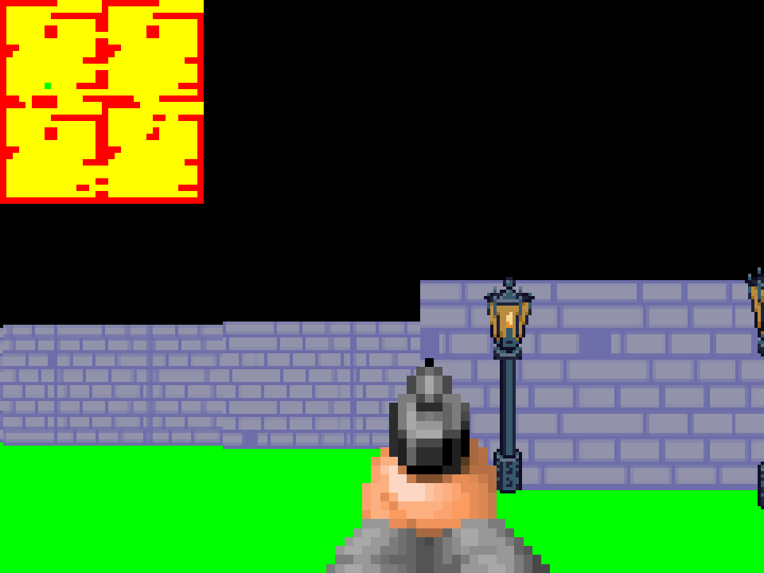

# Simpe Ray Casting v2 Qt/C++
Simple Ray Casting which use Qt/C++.
## Screenshot

### Installing
A step by step series  that tell you how to get a execute project.
Get it from GitHub
```
git clone git@github.com:Przemekkkth/simple-ray-casting-2-qt-cpp
```
Compile
```
qmake && make
```
## Addons
* [Qt](https://www.qt.io/) - Cross-Platform software for embedded & desktop
* [Github](https://github.com/OneLoneCoder/CommandLineFPS) - inspiration, great tutorial for ray casting
* [Lamp image](https://opengameart.org/content/lpc-lamp-posts-rework) - opengameart
